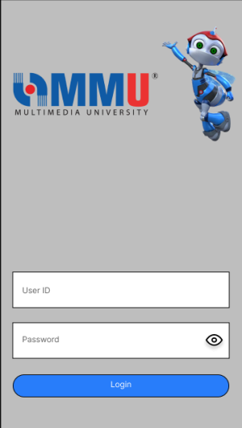
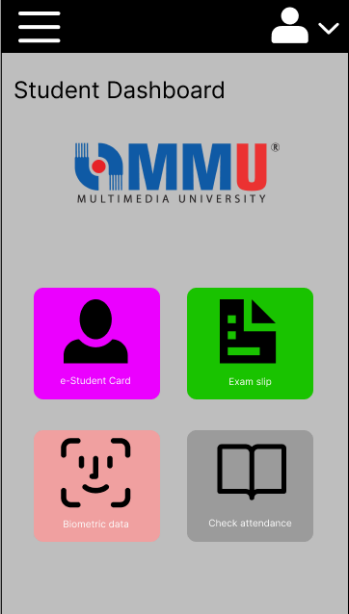
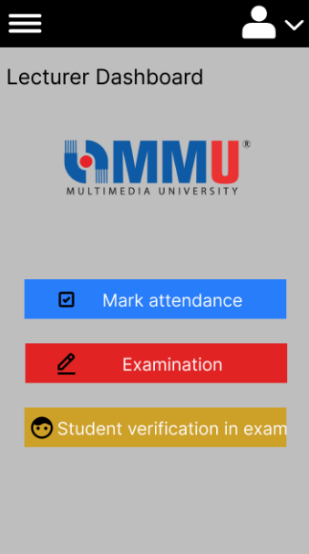
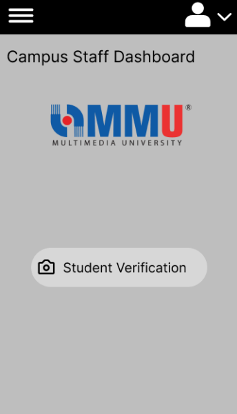

# e-StudentCard For Biometrics Attendance System - (FYP Project)

## Introduction

### Overview
In Malaysian universities, students commonly mark attendance by scanning QR codes with their smartphones. While convenient, this method has a significant flaw: students can easily cheat by sharing QR codes with their friends, leading to a lack of genuine attendance and learning. Multimedia University (MMU) Cyberjaya currently faces this issue with its QR code attendance system.

To combat attendance fraud, we propose a biometrics attendance system. By utilizing facial recognition and fingerprint scanning, students must be physically present to mark their attendance, ensuring authenticity. The project aims to develop a mobile application that functions as an electronic student card (e-StudentCard), allowing students to register their biometrics for attendance and access campus services.

### Problem Statement
MMU students often forget their physical student cards, which serve essential purposes, such as accessing campus facilities and attending exams. This oversight can lead to significant academic consequences. Additionally, the current QR code system facilitates attendance cheating, undermining academic integrity.

### Project Objectives
- Identify requirements for a secure access control module within the e-StudentCard app.
- Design an examination integrity assurance module to prevent impersonation during exams.
- Develop a reliable attendance system using students' biometric data.

### Project Scope
This mobile application targets MMU students and lecturers, providing a user-friendly interface. Students can register biometric data and access their e-StudentCard, while lecturers can mark attendance through facial recognition. The system will also help prevent identity theft during exams, ensuring a more secure academic environment.

### Platforms Used
- **Flutter**: For developing a cross-platform mobile application.
- **Firebase**: For storing user login credentials and course information.
- **Google ML Kit**: For face detection functionalities.
- **FaceNet**: For face recognition capabilities.

## Functional Requirements

| User Type       | Functional Requirement                               |
|------------------|-----------------------------------------------------|
| **Student**      | - Register biometric data                            |
|                  | - Check class attendance                             |
|                  | - View e-StudentCard                                |
|                  | - View exam slip                                    |
| **Lecturer**     | - Log student attendance                             |
|                  | - Assign students for examinations                   |
|                  | - Verify student identities during exams            |
| **Campus Staff** | - Verify student identities on campus               |
| **Administrator**| - Create accounts for users                          |
|                  | - Delete user accounts                               |

## Screen Design

### Login Page 

### Student Dashboard

### Lecturer Dahboard

### Campus Staff

### Administrator Dashboard

## Further Description and User Manual

For more detailed information, please refer to the [Functional Requirements PDF](https://github.com/ThamizharaasanMMU/e-Student-Card-For-Biometrics-Attendance-System/blob/main/1201101703_2798_amended%20final%20report.pdf).

